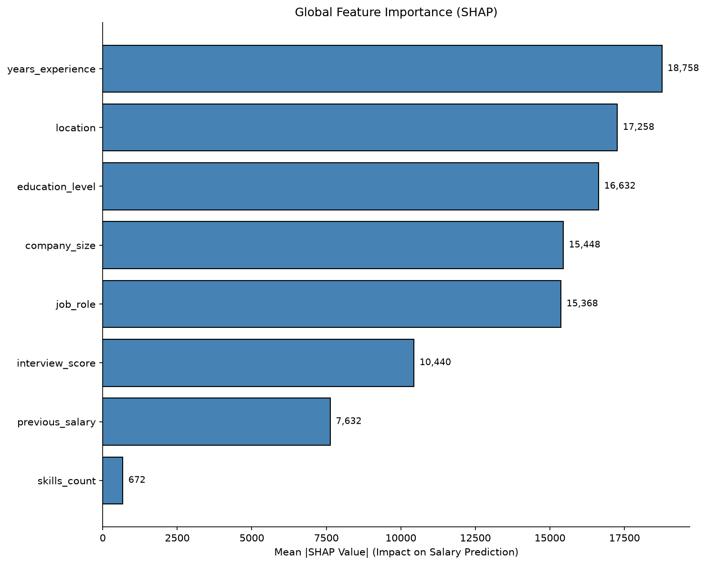

# FairPay: Salary Prediction and Pay Equity Tool

[](https://python.org)
[](https://streamlit.io)
[](https://scikit-learn.org)
[](LICENSE)

An end-to-end machine learning system that predicts fair salary offers for job candidates while auditing for pay equity across protected groups.

## Problem Statement

Company X's HR department must:
- **Avoid discrimination** between employees with similar profiles
- **Maintain consistent salary ranges** for comparable candidates
- **Reduce manual judgment** in salary decisions
- **Consider multiple factors**: experience, skills, education, interview performance, location, company size

FairPay addresses this by providing a data-driven salary recommendation engine with built-in fairness auditing and explainability.

## Architecture

```
┌─────────────────┐     ┌──────────────────┐     ┌─────────────────┐
│  Synthetic Data │────▶│  Preprocessing   │────▶│  Model Training │
│  (2,500 samples)│     │  Pipeline        │     │  (Ridge Reg.)   │
└─────────────────┘     └──────────────────┘     └────────┬────────┘
                                                          │
                                                          ▼
┌─────────────────┐     ┌──────────────────┐     ┌─────────────────┐
│  Streamlit App  │◀───│  SHAP Explain.   │◀───│  Fairness Audit │
│  (Web UI)       │     │  (Global/Local)  │     │  (Gender/Age)   │
└─────────────────┘     └──────────────────┘     └─────────────────┘
```

## Features

- **Salary Prediction**: Ridge Regression model with MAE ~$16,875, R² = 0.889
- **Fairness Auditing**: Demographic parity & equalized odds across gender/age
- **SHAP Explainability**: Global feature importance + per-prediction breakdowns
- **Web Interface**: Clean Streamlit UI for single & batch predictions
- **Production Ready**: Docker, tests, type hints, CI/CD ready

## Quick Start

### Local Development

```bash
# Clone and navigate
git clone <repo-url>
cd salary-prediction-ml

# Install dependencies
pip install -r requirements.txt

# Generate synthetic data (or use your own)
python data/generate_data.py

# Run EDA
jupyter notebook notebooks/01_eda.ipynb

# Train model
python src/train.py

# Run fairness audit
python src/fairness.py

# Generate SHAP explanations
python src/explain.py

# Launch web app
streamlit run app/streamlit_app.py
```

### Docker

```bash
# Build image
docker build -t fairpay .

# Run container
docker run -p 8501:8501 fairpay

# Open http://localhost:8501
```

## Model Performance

| Model | CV MAE | Test MAE | Test RMSE | Test R² |
|-------|--------|----------|-----------|---------|
| Linear Regression | $15,877 | $16,909 | $22,710 | 0.8884 |
| **Ridge Regression** | **$15,880** | **$16,875** | **$22,651** | **0.8889** |
| Random Forest | $20,970 | $22,377 | $28,568 | 0.8233 |

**Best Model**: Ridge Regression (α=1.0)

## Fairness Results

| Metric | Gender | Age Group |
|--------|--------|-----------|
| Demographic Parity Gap | 2.7% | 3.5% |
| TPR Gap (Equalized Odds) | 0.026 | 0.020 |
| FPR Gap (Equalized Odds) | 0.061 | 0.060 |

✅ All gaps below 5% threshold — no systematic disadvantage detected.

### Proxy Feature Analysis
No features found to strongly correlate with protected attributes (threshold: |r| > 0.3 or p < 0.05).

## SHAP Explainability

**Global Feature Importance** (Mean |SHAP|):
1. Previous Salary
2. Years of Experience
3. Interview Score
4. Job Role (Engineering Manager, ML Engineer)
5. Location (San Francisco, New York)
6. Education Level (PhD, Master)
7. Company Size (Large)
8. Skills Count

**Local Explanations**: Every prediction shows feature contributions pushing salary above/below average.

## Project Structure

```
salary-prediction-ml/
├── app/
│   └── streamlit_app.py      # Web application
├── data/
│   ├── generate_data.py      # Synthetic data generator
│   └── salary_data.csv       # Generated dataset (gitignored)
├── models/
│   ├── best_model.joblib     # Trained model (gitignored)
│   ├── training_summary.json # Model comparison results
│   ├── fairness_audit.json   # Fairness audit results
│   └── shap_analysis.json    # SHAP analysis results
├── notebooks/
│   └── 01_eda.ipynb          # Exploratory data analysis
├── src/
│   ├── train.py              # Training pipeline
│   ├── fairness.py           # Fairness audit
│   └── explain.py            # SHAP explainability
├── tests/
│   └── test_preprocessing.py # Unit tests
├── Dockerfile                # Container configuration
├── requirements.txt          # Python dependencies
├── DEPLOY.md                 # Deployment guide
└── README.md                 # This file
```

## Screenshots

### Single Prediction


### Batch Prediction
Upload CSV → Get predictions → Download results

### Fairness Dashboard
Demographic parity, equalized odds, intersectional analysis

## Deployment

See [DEPLOY.md](DEPLOY.md) for step-by-step instructions for:
- **Streamlit Community Cloud** (free, recommended)
- **Hugging Face Spaces** (free, good for ML demos)
- **Docker** (any cloud provider)
- **Local/On-premise**

### Streamlit Community Cloud (Easiest)
1. Push to GitHub
2. Connect at [share.streamlit.io](https://share.streamlit.io)
3. Deploy in 2 minutes

### Hugging Face Spaces
1. Create Space at [huggingface.co/new-space](https://huggingface.co/new-space)
2. Select "Docker" or "Streamlit" template
3. Push code

## Limitations & Ethical Considerations

⚠️ **Important Limitations:**

1. **Synthetic Data**: This demo uses generated data. Production requires real, representative historical data.
2. **Historical Bias**: Models trained on past decisions may perpetuate existing biases.
3. **Context Missing**: Soft skills, culture fit, negotiation, market dynamics not captured.
4. **Protected Attributes**: Only gender and age audited; race, disability, veteran status not in data.
5. **Prediction Intervals**: Based on RMSE approximation, not statistically rigorous conformal prediction.

🛡️ **Ethical Guidelines:**
- This tool provides **recommendations**, not binding decisions
- **Human review required** for all salary offers
- Conduct **regular fairness audits** (quarterly minimum)
- **Retrain periodically** with new hiring data
- Be **transparent** with candidates about algorithmic assistance
- Document and review **edge cases** and disagreements

## Contributing

1. Fork the repository
2. Create feature branch (`git checkout -b feature/amazing-feature`)
3. Commit changes (`git commit -m 'Add amazing feature'`)
4. Push to branch (`git push origin feature/amazing-feature`)
5. Open Pull Request

## License

MIT License — see [LICENSE](LICENSE) for details.

## Live Demo

[](https://fairpay.streamlit.app)

*Demo link placeholder — deploy your own using DEPLOY.md instructions*